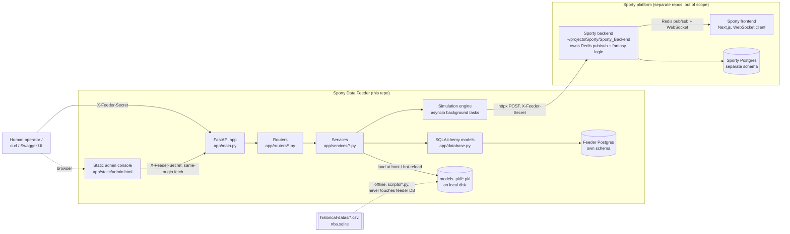
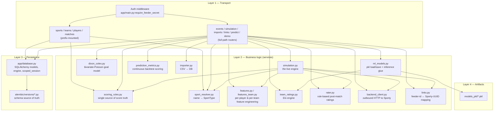

# Architecture

See `GLOSSARY.md` for all abbreviations. All file paths are relative to the repository
root (`/home/sam069/projects/SportyDataFeeder`).

## 1. High-level architecture



Key properties, all verifiable in code:

- **Two independent databases.** The feeder's `DATABASE_URL` (`app/config.py`) points at
  its own Postgres instance. It never imports or connects to anything in the Sporty
  backend repo. Integration is HTTP-only (`app/services/backend_client.py`).
- **No message broker anywhere in the feeder.** `PRD.md` §1 states this as policy; no
  `redis`/`kafka`/`celery` import exists in `app/` or `scripts/`.
- **Historical training data never enters the operational database.** `scripts/load_historical.py`
  and `scripts/load_nba.py` are explicitly read-only loaders over CSV files
  (`historical-datas/*.csv`) and a bundled SQLite dump (`nba.sqlite`); the resulting
  Elo ratings and event rates are baked into pickle files, not database rows
  (`scripts/load_historical.py:5-8`: *"Does NOT touch the application database... the
  real matches stay out of the simulated `matches` table"*).
- **The admin console is a static HTML file, not a separate frontend app.** `GET /admin`
  (`app/main.py:74-80`) serves `app/static/admin.html` directly; its JavaScript calls the
  same feeder API, same-origin, supplying the shared secret from a field in the page.

## 2. Backend architecture (layered view)



FastAPI's dependency-injection system (`Depends(get_db)`) wires a request-scoped
SQLAlchemy session into every router function; there is no separate "repository" layer —
routers query the ORM directly, and reusable cross-cutting logic (scoring, feature
computation, sport resolution) lives in `app/services/`.

## 3. Folder-by-folder walkthrough

### `app/` — the live application

The only package that runs in production. Nothing outside `app/` is imported by
`app/main.py` at request-serving time (scripts and tests import `app/`, never the other
way around, which keeps the dependency graph acyclic — see `app/services/prediction_metrics.py:92-94`
for an explicit comment about this).

| File | Purpose | Key exports |
|---|---|---|
| `app/main.py` | FastAPI app factory, router registration, auth middleware, `/health`, `/admin`, `/models/reload` | `app` (the ASGI app), `lifespan` |
| `app/config.py` | The single configuration source | `Settings`, `get_settings()` (lru-cached) |
| `app/database.py` | All 9 ORM models, engine, session factories | `Base`, `Sport`, `Team`, `Player`, `Match`, `Event`, `EntityLink`, `PlayerStat`, `MatchPrediction`, `PlayerMatchRating`, `engine`, `Session`, `SessionFactory`, `get_db()` |
| `app/schemas.py` | Every Pydantic request/response model | `*Create`, `*Read` pairs |
| `app/static/admin.html` | Single-file, dependency-free HTML/CSS/JS control panel | served at `GET /admin` |

#### `app/routers/` — HTTP surface (one file per resource/concern)

| File | Mount | Responsibility |
|---|---|---|
| `sports.py` | `/sports` prefix | CRUD for the `sports` reference table |
| `teams.py` | `/teams` prefix | CRUD for teams, scoped by sport |
| `players.py` | `/players` prefix | CRUD for players, scoped by team/sport |
| `matches.py` | `/matches` prefix | Fixture CRUD, score computation (`_score_match`), Sporty-backend fixture scheduling/deletion, lineup preview |
| `events.py` | full path `/matches/{id}/events` | List/create raw match events |
| `simulation.py` | full path `/simulate*`, `/matches/{id}/replay-push` | Start/stop/inspect live simulations; outage-recovery replay |
| `imports.py` | full path `/imports/*` | CSV roster+stat ingestion endpoints |
| `links.py` | full path `/links` | CRUD for `entity_links` |
| `predict.py` | full path `/predict*` | Outcome prediction, prediction metrics/backtest scorecard |
| `demo.py` | full path `/demo/launch` | One-call orchestration: schedule + register players + predict + simulate |

#### `app/services/` — business logic, no HTTP concerns

| File | Purpose |
|---|---|
| `scoring_rules.py` | The **only** place event→points math is defined |
| `sport_resolver.py` | The **only** place sport-name string matching is defined |
| `simulation.py` | The live simulation engine (see `SIMULATION.md`) |
| `backend_client.py` | httpx wrapper for every outbound call to the Sporty backend, with retry/backoff |
| `importer.py` | CSV parsing + idempotent upsert into `players`/`teams`/`player_stats` |
| `links.py` | `upsert_link` / `get_sporty_uuid` / `delete_link` for `entity_links` |
| `features.py` | Per-player rate/form features from `player_stats`, with cold-start fallbacks; per-team strength |
| `features_team.py` | Causal rolling team-level features for offline model training (rest days, shots-on-target form, points-per-game form) |
| `team_ratings.py` | The Elo rating engine (fit/update/annotate), shared by football and basketball |
| `dixon_coles.py` | The Dixon-Coles bivariate-Poisson goal model (an evaluated-but-not-shipped candidate — see `MODELS.md`) |
| `ml_models.py` | pkl load/save, `predict_outcome` (v1 heuristic/logistic path), `predict_outcome_v2` (Elo-bundle inference) |
| `rater.py` | Rule-based post-match player ratings and man-of-the-match selection |
| `prediction_metrics.py` | Joins stored predictions to finished-match results; computes accuracy/log-loss/Brier/ECE per model version |

### `alembic/` — schema migrations (the schema source of truth)

Three linear migrations (`0001_initial_schema` → `0002_entity_links_and_stats_tables` →
`0003_add_event_id_to_events`); see `DATABASE.md` for the full column-by-column history.
`alembic/env.py` falls back to `app.config.get_settings().DATABASE_URL` when no URL is
passed explicitly, so `alembic upgrade head` works with no extra flags once `.env` is set.

### `scripts/` — everything that runs outside the request/response cycle

Three sub-groups, distinguishable by their own docstrings and by whether they write to
`models_pkl/`:

1. **Operational** (run against the live app's own DB): `seed_sports.py` (idempotent
   reference-data seed), `train_models.py` (legacy v1 event-rates + outcome model),
   `refresh_bundles.py` (cron-friendly wrapper that rebuilds both production Elo bundles
   and optionally hot-swaps them into a running process via `POST /models/reload`).
2. **Data loaders** (read-only, never touch the app DB): `load_historical.py` (EPL CSVs),
   `load_nba.py` (NBA SQLite dump + recent-seasons CSV), `fetch_championship.py` /
   `fetch_nba_recent.py` (scrapers that populate the CSVs the loaders read).
3. **Research / experiment scripts** (each one explicitly states in its own docstring
   *"NOTHING is wired into the live app here"*): `backtest_outcome.py`,
   `backtest_basketball.py`, `backtest_nba_odds.py`, `train_outcome_v2.py` through
   `train_outcome_v5.py`, `train_basketball_v3.py`. These are the lab notebooks that
   produced the `reports/*.md` files and the winning configuration baked into
   `finalize_outcome_v2.py` / `finalize_outcome_basketball.py` — the two scripts that
   *do* produce the files the live app loads (`models_pkl/outcome_v2.pkl` and
   `models_pkl/outcome_v2_basketball.pkl`).

### `tests/` — pytest suite against throwaway SQLite

`tests/conftest.py` sets `DATABASE_URL` to a temp SQLite file *before* importing any
`app.*` module (required because `Settings` is `lru_cache`d and the SQLAlchemy engine is
built at import time). One `fresh_db` autouse fixture drops+recreates all tables and
clears the simulation registry between every test. Covers: app boot/health,
auth middleware, CRUD for every resource, scoring rules, sport-resolver aliases,
importer idempotency, ML model loading, feature computation, prediction endpoint,
full simulation runs (including calibration and substitutions), and that
`alembic upgrade head` builds the complete schema from empty.

### `reports/` — generated Markdown lab notebooks

Every file here (`OUTCOME_MODEL_*.md`, `MODEL_VALIDATION_REPORT.md`,
`MODEL_IMPROVEMENT_PLAN.md`) is **written by the research scripts in `scripts/`**, not
hand-authored — e.g. `scripts/backtest_outcome.py:246` does `REPORT.write_text(md)`.
`MODEL_IMPROVEMENT_PLAN.md` is the current best index of "what was tried and what won";
see `MODELS.md` for the distilled version.

### `historical-datas/` — raw offline training inputs

EPL season CSVs (`football-data.co.uk` schema: `E0.csv`...`E12.csv` for the top flight
across seasons, `championship/E1_*.csv` for the second tier), `nba_recent_games.csv`
(scraped seasons not in the SQLite dump), `nba_odds_10y.json` (historical NBA moneylines
used only for evaluation, never for the live model).

### Root-level files worth knowing about

| File | Status |
|---|---|
| `legacy_database.py.bak` | Dead artifact from before the `app/` restructure — `CLAUDE.md` explicitly says never import it; confirmed nothing in `app/` or `scripts/` references it |
| `nba.sqlite` | The Kaggle NBA games dump read by `scripts/load_nba.py` |
| `nba_player_stats_2026.csv`, `premier_league_complete_stats_until*.csv` | Sample/real roster+stat CSVs consumed by `POST /imports/*` |
| `.env.example` | Template for the 4 required/defaulted environment variables (see `CONFIGURATION_DEPLOYMENT.md`) |
| `DEMO_RUNBOOK.md` | Hand-authored (not generated) end-to-end guide for running feeder+backend+frontend together for a live demo |

## 4. Request lifecycle

Every inbound HTTP request goes through the same pipeline. Concretely traced for
`POST /predict` (chosen because it touches almost every layer):

```mermaid
sequenceDiagram
    participant C as Client (curl/Swagger/admin.html)
    participant MW as Auth middleware<br/>(app/main.py)
    participant R as Router<br/>(app/routers/predict.py)
    participant SV as Services<br/>(features.py, ml_models.py)
    participant DB as SQLAlchemy session<br/>(app/database.py)
    participant PG as Postgres
    participant BC as backend_client.py
    participant SB as Sporty backend

    C->>MW: POST /predict {"match_id": 7}<br/>header X-Feeder-Secret
    MW->>MW: secrets.compare_digest(header, settings.FEEDER_SECRET)
    alt secret invalid or missing
        MW-->>C: 401 {"detail": "Missing or invalid X-Feeder-Secret header"}
    else secret valid
        MW->>R: call_next(request)
        R->>DB: Depends(get_db) opens a scoped Session
        R->>DB: SELECT match, sport, home/away team
        DB->>PG: query
        PG-->>DB: rows
        R->>SV: predict_outcome_v2(bundle, home_name, away_name)<br/>OR compute_team_strength() + predict_outcome()
        SV-->>R: {home_win_prob, draw_prob, away_win_prob, model_version, ...}
        R->>DB: INSERT MatchPrediction row; commit
        R->>DB: get_sporty_uuid(db, "match", match.id)
        opt match is linked to Sporty
            R->>BC: push_prediction(payload)
            BC->>SB: POST /api/v1/feed/prediction (3 attempts, 1.5^n backoff)
            SB-->>BC: 2xx or error
        end
        R-->>C: 200 PredictResponse
        DB->>DB: session closed in get_db()'s finally block
    end
```

Generalized, every route follows:

```
1. Client       → HTTP request with X-Feeder-Secret header (except /health, /docs,
                   /openapi.json, /admin, /admin/)
2. Middleware   → app.main.require_feeder_secret: constant-time secret compare
3. Routing      → FastAPI path matching to a function in app/routers/*.py
4. Validation   → Pydantic parses/validates the request body against a *Create /
                   *Request schema declared in app/schemas.py (422 on failure,
                   handled entirely by FastAPI/Pydantic, no custom code)
5. DB session   → Depends(get_db) yields a Session() from the scoped_session registry
6. Business logic → router calls into app/services/*.py as needed
7. ORM          → SQLAlchemy queries/commits against app/database.py models
8. Database     → Postgres (or SQLite in tests)
9. Background   → for /simulate and /demo/launch only: an asyncio.Task is scheduled
                   on the running event loop and the HTTP response returns
                   immediately (202) without waiting for it
10. Response    → a *Read/*Response Pydantic model serializes the ORM objects
                   (`ConfigDict(from_attributes=True)` lets Pydantic read straight off
                   the SQLAlchemy instance's attributes)
```

There is no separate "controller" or "presenter" abstraction — the router function *is*
the controller, and Pydantic schemas double as both request validators and response
serializers.

## 5. Design patterns actually present in the code

| Pattern | Where | How it's used |
|---|---|---|
| **Dependency Injection** | Every router, via `db=Depends(get_db)` | FastAPI calls `get_db()` (a generator) per request, injects the yielded `Session`, and runs the `finally: db.close()` after the response is built |
| **Factory** | `app.config.get_settings()`, `app.services.backend_client.get_backend_client()` | Both are plain functions returning a fresh/cached instance rather than a module-level singleton object; `get_backend_client` is deliberately monkey-patchable in tests (`tests/conftest.py`-style patterns referenced in `backend_client.py:143-146`) |
| **Singleton (process-lifetime)** | `app.config.get_settings` (`@lru_cache`), `app.database.engine`/`Session` (module-level, created once at import) | One `Settings` object and one SQLAlchemy `Engine`/`scoped_session` registry per process |
| **Strategy** | `app/services/sport_resolver.py` (`SportType` dispatch), `app/services/scoring_rules.py` (`event_score_value` branches on `SportType`), `EloModel._mov_multiplier` (`mov` string selects `wfe`/`fte`/none) | Behavior is selected by an enum/string tag rather than subclassing — a lightweight, data-driven strategy pattern idiomatic to this codebase (no class hierarchies for sports) |
| **Adapter** | `app/services/backend_client.py` | Wraps `httpx.AsyncClient` behind a small `BackendClient` class exposing domain-shaped methods (`push_match_result`, `schedule_match`, ...) so callers never touch `httpx` directly |
| **Builder** (functional style) | `build_match_result_payload`, `build_player_ratings_payload` in `simulation.py` | Pure functions that assemble the exact JSON shape the Sporty backend expects, decoupled from *when* they're called (used identically by the live loop and by `replay_push`) |
| **Repository (thin/implicit)** | `app/services/links.py` (`upsert_link`, `get_sporty_uuid`, `delete_link`) | The only service module that fully encapsulates CRUD for one table behind named functions rather than routers querying directly |
| **Registry** | `app/services/simulation.py:_simulations: dict[int, SimulationState]` | Process-wide, match-id-keyed registry of running/finished simulation state; not persisted, not distributed |
| **Pipeline (ML)** | `sklearn.pipeline.Pipeline([("scaler", ...), ("clf", LogisticRegression())])` throughout `scripts/train_*.py` / `finalize_*.py` | Scaler + classifier are serialized together so inference never needs a separately-tracked preprocessing step (explicitly called out as a convention in `app/services/ml_models.py:1-6`) |

Patterns explicitly **absent**: no class-based "Service" objects (services are modules of
free functions operating on a passed-in `db` session), no Observer/event-bus (the
simulation loop calls `backend_client` directly rather than publishing an event), no
class-per-sport hierarchy (sport-specific behavior is `if sport_type is SportType.X`
branches plus per-sport dict constants).

## 6. Resilience patterns

| Pattern | Where | Detail |
|---|---|---|
| **Retry with exponential backoff** | `app/services/backend_client.py:_post` | `MAX_ATTEMPTS = 3`, delay `= backoff_base ** attempt` where `backoff_base = 1.5` (so ~1.5s, ~2.25s between the 3 attempts); applies to every "fire-and-forget" push (`push_match_result`, `push_prediction`, `push_player_ratings`, `push_model_metrics`) |
| **Idempotency keys** | `Event.event_id` (UUID4, generated in `app/services/simulation.py:_make_event` and `app/routers/events.py`) | The Sporty backend is documented (`CLAUDE.md`, `PRD.md` §4) to upsert on `event_id` so replays and retried pushes never double-count |
| **Graceful degradation (ML)** | `app/services/ml_models.py:load_model/predict_outcome/heuristic_outcome` | A missing/corrupt `.pkl` file logs a `WARNING` (never raises); `/predict` falls back from `outcome_v2` (Elo bundle) → `outcome_model` (v1 logistic) → `heuristic_outcome` (a hand-coded formula) — three concentric fallback rings |
| **Graceful degradation (features)** | `app/services/features.py:_fallback_features` | A player with zero `player_stats` rows gets league-average constants instead of a `ZeroDivisionError` or 500 |
| **Timeouts** | `app/services/backend_client.py`: `REQUEST_TIMEOUT = 5.0` (pushes), `SETUP_TIMEOUT = 30.0` (orchestration calls like `schedule_match`) | Every `httpx.AsyncClient` call is bounded; a hung Sporty backend cannot hang the feeder's push loop indefinitely (it will still block that one minute's push for up to 3×5s ≈ 15s of attempts) |
| **Error isolation per simulation** | `app/services/simulation.py:run_simulation`'s outer `try/except Exception` | A crash mid-simulation is caught, the match/simulation state is marked `"error"`, and the exception is logged — it never crashes the ASGI server process; other concurrent simulations are unaffected (separate `SimulationState` per match id) |
| **Never-fatal push failures** | Every `await client.push_*(...)` call in `simulation.py` only increments `state.push_failures`; simulation logic never branches on push success | A backend outage degrades observability, not correctness — events are always durably written to the feeder's own DB first, HTTP push happens after |
| **Outage recovery / replay** | `POST /matches/{id}/replay-push` (`app/routers/simulation.py`) | Re-reads every stored `Event` row for a match and re-sends the whole match-result payload in one call; backfills any legacy `NULL` `event_id`s first so the backend can dedupe |
| **Constant-time secret comparison** | `app/main.py:require_feeder_secret` uses `secrets.compare_digest` | Prevents timing side-channel attacks against the shared-secret header (a real resilience/security control, not just an equality check) |
| **Non-fatal missing dependencies at boot** | `app/main.py:_load_models_into_state` | A missing `models_pkl/*.pkl` never prevents the FastAPI app from starting; `/health` simply reports which models are absent |
| **Explicit conflict prevention, not locking** | `is_running(match_id)` checked before `POST /simulate` (409 Conflict) and before `DELETE /matches/{id}` | Prevents two concurrent simulations for the same match by checking the in-memory registry rather than a DB-level lock — correct only because there is a single feeder process (see `IMPROVEMENTS.md` for the multi-process caveat) |

**Not present:** circuit breakers (no failure-rate tracking or "open" state across
requests — every push independently retries 3 times regardless of recent history), dead
letter queues (a failed push after 3 attempts is simply logged; the only recovery path is
the manual/late `replay-push` call), rate limiting (no per-client throttling anywhere).

## 7. Algorithms catalogue

This section lists every non-trivial algorithm in the codebase with complexity and
rationale. ML-specific algorithms (Elo, Dixon-Coles, logistic regression) are detailed in
depth in `MODELS.md`; simulation-loop algorithms are detailed in `SIMULATION.md`. This is
the index.

| Algorithm | Where | Time complexity | Space complexity | Why chosen |
|---|---|---|---|---|
| Elo rating update (sequential) | `app/services/team_ratings.py:EloModel.update`/`fit_elo` | O(1) per match, O(M) to process M matches | O(T) for T teams' ratings | Simple, well-understood, incrementally updatable without retraining, naturally handles new/promoted teams via a default rating |
| Margin-of-victory Elo multiplier | `EloModel._mov_multiplier` | O(1) | O(1) | Plain win/loss Elo ignores blowouts vs. nail-biters; MOV variants (`wfe`, `fte`) are industry-standard corrections (World Football Elo, FiveThirtyEight) |
| Exponentially weighted moving average (form) | `app/services/features.py:_ewma` | O(n) for n stat rows (n ≤ `MAX_FORM_ROWS`=20) | O(1) accumulator | Recent matches should count more than old ones; EWMA is cheaper than a full time-series model and needs no extra library |
| Poisson PMF (vectorised) | `app/services/dixon_coles.py:_poisson_pmf` | O(k) for k = 0..`MAX_GOALS` | O(k) | Football scores are well-approximated by independent Poisson counts; vectorised via NumPy for the whole score matrix at once |
| Dixon-Coles low-score correction (τ) | `app/services/dixon_coles.py:_tau` | O(1) per (x,y) pair, only applied to the 2×2 low-score block | O(1) | Corrects a documented systematic under-prediction of low scorelines (0-0, 1-0, 0-1, 1-1) that plain independent-Poisson models make |
| L-BFGS-B numerical optimisation | `DixonColes.fit` via `scipy.optimize.minimize` | Depends on solver iterations × O(M) per gradient evaluation (M = matches); capped at `maxiter=500` | O(2T+2) parameters | Standard quasi-Newton bound-constrained optimiser; used because the Dixon-Coles log-likelihood has no closed-form MLE |
| Multinomial logistic regression (lbfgs) | `sklearn.linear_model.LogisticRegression` throughout | Training ~O(n_features² · n_samples) per lbfgs iteration (sklearn-internal) | O(n_features · n_classes) | Well-calibrated multi-class probabilities from a handful of numeric features (Elo diff, SoT form, etc.); no need for a more complex model given the tiny feature count (`reports/MODEL_IMPROVEMENT_PLAN.md`: *"GBMs/neural nets on ~4,900 matches... 7 features overfit relative to 1"*) |
| Simplex-weight blend fitting (softmax-parametrised Nelder-Mead) | `scripts/train_outcome_v3.py:fit_blend_weights` | O(iterations · members) | O(members) | A research-only experiment (not shipped) to combine multiple candidate models' probabilities into one blended prediction, weights constrained to sum to 1 via a softmax reparametrisation so unconstrained Nelder-Mead can be used |
| Bernoulli/binomial event sampling | `numpy.random.binomial(1, p)` in `app/services/simulation.py:_sample_minute_events` | O(events_per_minute × players) per minute | O(events fired) | Each (player, event-type, minute) is modeled as an independent Bernoulli trial at that player's per-minute rate — the core "stat-weighted" mechanism replacing the old pure-random simulator |
| Weighted random choice (assist attribution) | `app/services/simulation.py:_pick_assister` (`numpy.random.choice` with a probability vector) | O(teammates) | O(teammates) | Assists are attributed to a teammate proportional to that teammate's own assist rate, so playmakers assist more often than defenders |
| Deterministic tie-break selection (lineup/substitution) | `_select_lineup`, `_football_substitutions`, `_basketball_rotation` in `simulation.py` | O(roster size) | O(roster size) | Uses `sorted`/`max`/`min` with explicit tie-break keys (lowest id, longest stint, most rest) so behavior is reproducible given the same RNG seed and roster |
| Unicode name folding | `_fold_name` (`simulation.py`), `_fold` (`demo.py`) | O(len(name)) | O(len(name)) | NFKD decomposition + diacritic stripping so "featured player" name matching is accent/case-insensitive (e.g. matching "Ødegaard" against "odegaard") |
| CSV filename gameweek/season inference (regex) | `app/services/importer.py:infer_gameweek_and_season` | O(len(filename)) | O(1) | Avoids requiring operators to manually specify gameweek/season on every import call |
