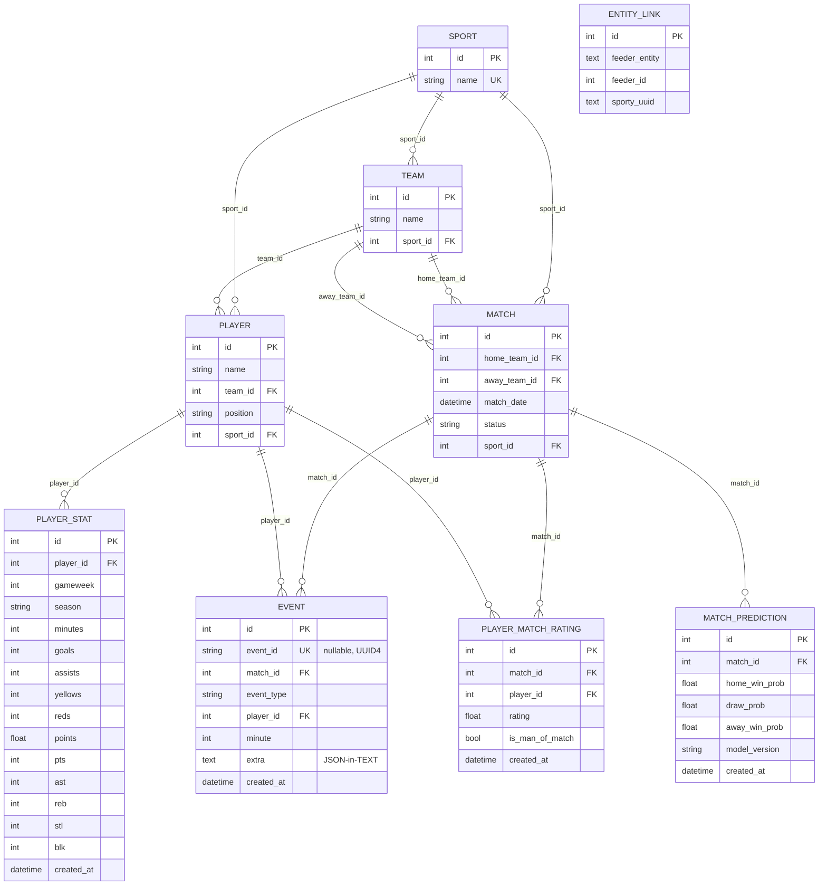

# Database

All models are declared in `app/database.py` using SQLAlchemy 2.0's `declarative_base()`.
Alembic (`alembic/versions/`) is the sole source of schema truth — `app/main.py` never
calls `Base.metadata.create_all()` in production (only `tests/conftest.py` does, against
a throwaway SQLite file, for test speed).

## 1. Entity-relationship diagram

`ENTITY_LINK` deliberately has no foreign key to any other table — `feeder_id` is a raw
integer whose *meaning* depends on `feeder_entity` (`"sport" | "team" | "player" |
"match"`, per `app/schemas.py:FeederEntity`), i.e. it's a **polymorphic** mapping table,
which is why SQLAlchemy can't express it as a normal relationship.

## 2. Table-by-table reference

All tables live in `app/database.py`. `utcnow()` (line 22-24) returns a naive UTC
`datetime` (no tzinfo) so it matches the historical `datetime.utcnow()`-style defaults —
this is a deliberate compatibility choice, not an oversight, per the inline comment.

### `sports`
- `id` (PK), `name` (`String`, `unique=True`, nullable in the column definition but every
  write path (`scripts/seed_sports.py`, `app/routers/sports.py:create_sport`) rejects an
  empty/blank name at the application layer).
- Seeded by `scripts/seed_sports.py` with exactly `["football", "basketball"]`
  (`SPORT_NAMES`). Cricket is a defined `SportType` enum value
  (`app/services/sport_resolver.py`) but **no cricket row is ever seeded and no cricket
  code path is exercised** — it exists purely so a future cricket implementation only
  needs to touch the resolver, per `CLAUDE.md`.
- Deletion (`DELETE /sports/{id}`) is blocked (400) if any team/player/match references
  it — enforced by an application-level `COUNT` query in `app/routers/sports.py`, **not**
  a database `ON DELETE RESTRICT` constraint (there is no explicit `ondelete=` on any FK
  in this schema).

### `teams`
- `id`, `name`, `sport_id` (FK → `sports.id`).
- Uniqueness of `(sport_id, name)` is enforced only in application code
  (`app/routers/teams.py:create_team` queries for an existing team before inserting) —
  **there is no database-level unique constraint** on this pair.

### `players`
- `id`, `name`, `team_id` (FK → `teams.id`), `position` (free string, nullable),
  `sport_id` (FK → `sports.id`, denormalized — duplicated from the team's sport rather
  than derived via a join, presumably for query simplicity).
- `app/routers/players.py:create_player` validates `team.sport_id == payload.sport_id`
  at the application layer to prevent this denormalization from drifting.

### `matches`
- `id`, `home_team_id`/`away_team_id` (FK → `teams.id`, **no CHECK constraint** that they
  differ — application code enforces `home_team_id != away_team_id` in
  `matches.py:create_match` and `simulation.py:_get_or_create_match`),
  `match_date` (nullable `DateTime`, defaults to `utcnow` only if omitted at the ORM
  level — `MatchCreate` in `schemas.py` actually requires it), `status` (free string,
  default `"scheduled"`; observed values in code: `"scheduled"`, `"live"`, `"finished"`,
  `"error"`; **no CHECK/ENUM constraint** — it's a plain `String`), `sport_id`.
- **Scores are never stored on this table.** `home_score`/`away_score` only exist as a
  *computed* field on `MatchDetailRead` (`app/schemas.py`), derived at read time by
  replaying every `Event` row through `app/services/scoring_rules.py:score_events`
  (`app/routers/matches.py:_score_match`). This is a deliberate, repeatedly-documented
  design decision (`CLAUDE.md`: *"Scores are never stored; they are derived from
  events"*) — the trade-off is that reading a match's score is O(events for that match)
  instead of O(1), and every score-related bug class (double counting, wrong sport
  mapping) is entirely contained in one function.

### `events`
- `id`, `event_id` (`String`, `unique=True`, **nullable** — legacy rows created before
  migration `0003` have `NULL` here; `POST /matches/{id}/replay-push` backfills them with
  a fresh `uuid4()` on first replay), `match_id` (FK), `event_type` (free string — no
  enum; observed values include `goal`, `assist`, `yellow_card`, `red_card`,
  `substitution`, `point_2`, `point_3`, `free_throw`, `rebound`, `steal`, `block`),
  `player_id` (FK, nullable — an event can be un-attributed to a player), `minute`
  (nullable `Integer`), `extra` (`Text`, nullable), `created_at`.
- **`extra` is a TEXT column holding a JSON string**, not a native JSONB/JSON column.
  Writers call `json.dumps(...)`; readers call `json.loads(...)` and silently degrade to
  `None` on a `json.JSONDecodeError` (`app/routers/events.py:_serialize_event`,
  `app/routers/matches.py:_score_match`). `CLAUDE.md` explicitly flags this as a known
  compromise ("Migration to JSONB is Phase 4+") that never actually happened — as of this
  audit, `extra` is still `Text` in every migration.
- No index is declared on `match_id`, `event_type`, or `minute` beyond whatever the FK
  creates implicitly at the database-engine level — every event query in the codebase
  (`_score_match`, `list_match_events`, `replay_push`) does a full filtered scan ordered
  by `(minute, created_at, id)`. For a demo-scale dataset this is irrelevant; see
  `IMPROVEMENTS.md`.

### `entity_links`
- `id`, `feeder_entity` (`Text`, one of `sport`/`team`/`player`/`match`),
  `feeder_id` (`Integer`), `sporty_uuid` (`Text`).
- `UNIQUE(feeder_entity, feeder_id)` — a feeder entity maps to at most one Sporty UUID.
  There is **no** reverse-uniqueness constraint (nothing stops two different feeder
  entities from mapping to the same `sporty_uuid`); this is never exploited in the code
  paths reviewed but is not defended against either.
- `upsert_link` (`app/services/links.py`) is a true upsert: look up by
  `(feeder_entity, feeder_id)`, update `sporty_uuid` if found, else insert. It supports
  `commit=False` for bulk-linking a whole lineup with a single commit at the end (used by
  `app/routers/demo.py:demo_launch`).

### `player_stats`
- `id`, `player_id` (FK, **not nullable**), `gameweek` (Integer, not nullable),
  `season` (String, not nullable), `minutes` (nullable), then two disjoint sets of
  nullable stat columns: football (`goals`, `assists`, `yellows`, `reds`, `points` —
  `points` is a `Float` holding a match rating like `7.4`, not a fantasy-points integer),
  basketball (`pts`, `ast`, `reb`, `stl`, `blk`), `created_at`.
- **This is a wide, sparse table by design** — a football import leaves `pts`/`ast`/etc.
  `NULL` and vice versa. There is no `sport_type` discriminator column on the row itself;
  callers infer which half of the columns are meaningful from the *player's* `sport_id`
  (joined via `player_id`).
- `UNIQUE(player_id, gameweek, season)` is what makes CSV re-imports idempotent — both
  `import_nba` and `import_premier_league` (`app/services/importer.py`) pre-load the set
  of existing `(player_id, gameweek, season)` tuples and skip any row that already exists
  rather than relying on a database-level `ON CONFLICT`.

### `match_predictions`
- `id`, `match_id` (FK, not nullable), `home_win_prob`/`draw_prob`/`away_win_prob`
  (`Float`, not nullable — **no CHECK that they sum to 1.0 or are within [0,1]**, trusted
  entirely from the model's output), `model_version` (String, not nullable — see
  `MODELS.md` for the version-string taxonomy), `created_at`.
- **Every `POST /predict` call inserts a new row; nothing is ever updated or deleted.**
  Multiple predictions for the same match accumulate over time (e.g. if you call
  `/predict` before and after a squad change). `app/services/prediction_metrics.py`
  explicitly documents the read-side rule for this: *"When a match was predicted several
  times by the same model version, only the LATEST prediction counts."* Different
  `model_version`s for the same match are tracked and scored **separately** so a model
  upgrade is visible as two distinct rows in the metrics output, not blended together.

### `player_match_ratings`
- `id`, `match_id` (FK, not nullable), `player_id` (FK, not nullable), `rating` (Float,
  not nullable, 1.0–10.0 by application-level clamping — see `MODELS.md`
  §Rule-Based Rater), `is_man_of_match` (Boolean, `server_default=false`), `created_at`.
- `UNIQUE(match_id, player_id)` — a player has at most one rating per match.
  `_store_ratings` (`app/services/simulation.py`) implements "recompute" as
  `DELETE ... WHERE match_id = ? then bulk INSERT`, not an upsert — safe because it's
  always called exactly once, at the end of one simulation run, inside the same
  transaction as the delete.

## 3. Migrations (Alembic)

| Revision | File | What it does |
|---|---|---|
| `0001_initial_schema` | `alembic/versions/0001_initial_schema.py` | Creates `sports`, `teams`, `players`, `matches`, `events` — the original 5-table schema (formerly created by `Base.metadata.create_all()` before Alembic was adopted; the migration's own docstring instructs operators with a pre-existing database to run `alembic stamp 0001_initial_schema` once rather than re-running the `CREATE TABLE`s) |
| `0002_entity_links_and_stats_tables` | `alembic/versions/0002_entity_links_and_stats_tables.py` | Adds `entity_links`, `player_stats`, `match_predictions`, `player_match_ratings` |
| `0003_add_event_id_to_events` | `alembic/versions/0003_add_event_id_to_events.py` | Adds `events.event_id` (nullable `String`) + a unique constraint on it, via `op.batch_alter_table` (SQLite-compatible ALTER, needed because SQLite can't add a constrained column in one step the way Postgres can — this is why the test suite, which runs on SQLite, works identically to production Postgres) |

`downgrade()` is implemented and symmetric for all three (each drops exactly what its
`upgrade()` created, in reverse dependency order), so `alembic downgrade -1` is safe to
use in development.

`alembic/env.py` imports `app.database.Base` for `target_metadata` and falls back to
`get_settings().DATABASE_URL` when Alembic isn't given an explicit URL — meaning
`alembic upgrade head` "just works" against whatever `.env` currently points at, with no
extra CLI flags. Autogenerate (`alembic revision --autogenerate`) is therefore fully
usable for any future schema change.

## 4. ORM & session conventions

- **Session strategy:** `Session = scoped_session(SessionFactory)`
  (`app/database.py:148`) provides a thread-local session for normal request handling via
  `get_db()`. Separately, `SessionFactory` (a plain `sessionmaker`) is used directly by
  `app/services/simulation.py` for each background task, because "concurrent asyncio
  simulation tasks share one thread" (per the module's own comment) — using the
  thread-scoped `Session` there would let multiple concurrent simulations silently share
  (and corrupt) one session object. **This is the one connection-management subtlety in
  the codebase and it's handled correctly.**
- **SQLite-only connect arg:** `connect_args={"check_same_thread": False}` is applied
  only when `DATABASE_URL` starts with `sqlite` — required because FastAPI's `TestClient`
  dispatches requests to worker threads and SQLite otherwise refuses cross-thread use of
  the same connection.
- **Transactions:** every write path calls `db.commit()` explicitly; there is no
  app-level use of `with db.begin():`. Failure handling is per-route: `IntegrityError` is
  caught and turned into a `400` in the CRUD routers (`sports.py`, `teams.py`,
  `players.py`, `matches.py`, `events.py`); the simulation loop's outer `try/except`
  calls `db.rollback()` before marking the match `"error"`.
- **Bulk deletes bypass the ORM identity map:** `app/routers/matches.py:delete_match`
  uses `db.query(Event).filter_by(match_id=match_id).delete(synchronize_session=False)`
  for `Event`/`MatchPrediction`/`PlayerMatchRating` because **there is no `ON DELETE
  CASCADE`** on any of these foreign keys — the comment in the code (`matches.py:255`)
  says so explicitly: *"No ON DELETE CASCADE on these FKs, so clear children before the
  match row."*
- **No connection pooling configuration** beyond SQLAlchemy's defaults — `create_engine`
  is called with no `pool_size`/`max_overflow`/etc. arguments.

## 5. Indexes and constraints summary

| Constraint | Table.columns | Enforced at |
|---|---|---|
| `UNIQUE` | `sports.name` | Database (column-level `unique=True`) |
| `UNIQUE` | `entity_links(feeder_entity, feeder_id)` | Database (named constraint `uq_entity_links_feeder_entity_feeder_id`) |
| `UNIQUE` | `player_stats(player_id, gameweek, season)` | Database (`uq_player_stats_player_gameweek_season`) |
| `UNIQUE` | `player_match_ratings(match_id, player_id)` | Database (`uq_player_match_ratings_match_player`) |
| `UNIQUE` | `events.event_id` | Database (`uq_events_event_id`, added in `0003`) |
| `UNIQUE` (app-level only) | `teams(sport_id, name)`, `players(team_id, name)` | Application code only — a race between two concurrent identical `POST` requests could still insert duplicates |
| FK | `teams.sport_id`, `players.team_id`, `players.sport_id`, `matches.home_team_id`, `matches.away_team_id`, `matches.sport_id`, `events.match_id`, `events.player_id`, `player_stats.player_id`, `match_predictions.match_id`, `player_match_ratings.match_id`, `player_match_ratings.player_id` | Database, none with `ondelete=` set (defaults to `NO ACTION`/`RESTRICT` per backend) |
| No index beyond PK/UK | `events(match_id)` lookups, `matches(status)` filters, `player_stats(player_id)` lookups | Full scans at current scale; see `IMPROVEMENTS.md` |

## 6. Explain Like I'm New

Think of this database as a sports almanac with five "core" tables (sports, teams,
players, matches, events) plus four "extra" tables bolted on later (one to remember which
Sporty backend UUID corresponds to which feeder row, one for imported real-world stats,
one for stored predictions, one for post-match ratings). The clever/unusual part is that
**the scoreboard number you see for a match is never actually stored anywhere** — every
time you ask "what's the score," the code re-reads every goal/point event for that match
and adds them up fresh, the same way you'd recount goals by rewinding a match tape rather
than trusting a running tally that could get out of sync.
