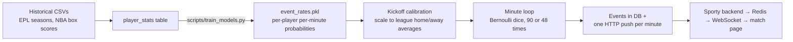

# How a Simulated Match Result Is Produced

**Audience:** anyone who needs to explain the feeder to someone else. Companion to
[`SIMULATION.md`](SIMULATION.md) (line-by-line engine audit) and [`MODELS.md`](MODELS.md)
(model internals) — this document explains the *flow*, end to end, with worked numbers.
Every constant quoted here is real and lives in `app/services/simulation.py` or
`app/services/features.py`.

**The one-paragraph version:** the feeder never "decides" a final score. It learns, from
historical stats, how often each individual player does each thing *per minute on the
pitch* — then replays a match one minute at a time, rolling dice against those
per-player probabilities. The score is simply the count of goal events the dice
produced. History sets the probabilities; randomness picks tonight's outcome; a
calibration step keeps the totals honest. That's why the same fixture gives a different
result every run, while a hundred runs converge on realistic averages.



---

## Stage 1 — History becomes per-player probabilities

### 1.1 The raw material

CSV imports (`/imports/*`) load real historical stats into `player_stats`: for football,
per-gameweek goals/assists/cards/minutes per player; for basketball, points, assists,
rebounds, minutes. This is the **only** place knowledge about the real world enters the
system.

### 1.2 The transformation (`compute_player_features`, `app/services/features.py`)

For each player, sum their history and divide by minutes actually played:

> **Worked example — a striker.** Suppose Saka's rows total **17 goals in 2,790
> minutes**. His per-minute goal rate is `17 / 2790 = 0.00609` — about one goal every
> 164 minutes on the pitch (`0.55 goals/90`, which is exactly his per-90 rate).

That per-minute number *is* the model for events. There is no neural network predicting
scores — just an honest empirical rate table per player:

```
event_rates.pkl = { player_id: {"goal": 0.00609, "assist": 0.0041,
                                "yellow_card": 0.0013, "red_card": 0.00005}, ... }
```

Alongside the rates, an **EWMA form index** (α = 0.4 over the newest ≤ 20 rows) captures
recent form; it feeds the *prediction* models and team-strength numbers, not the event
dice directly.

`scripts/train_models.py` builds this table for every player with stats and pickles it
as `models_pkl/event_rates.pkl`. It loads into `app.state` at API startup.

### 1.3 Cold starts never crash

A player with no history gets league-average fallback rates
(`FOOTBALL_FALLBACK_RATES`): `goal 0.003/min`, `assist 0.003`, `yellow 0.002`, straight
`red 0.00007`. Basketball has its own set. So an un-trained roster still simulates — it
just plays like a league-average team (a startup WARNING tells you it happened).

---

## Stage 2 — Kickoff calibration (why totals stay realistic)

Raw summed rates drift: a star-heavy XI might "expect" 3.4 goals, a fallback XI 2.7.
`calibrate_scoring_rates` fixes the *level* while preserving each player's *share*.

The targets are real league averages — **home and away separately**, which is how home
advantage gets into the sim without any explicit "home bonus":

| Sport | Home target | Away target |
|---|---|---|
| Football | `1.55 − 0.117 = 1.433` goals | `1.25 − 0.117 = 1.133` goals |
| Basketball | `104.9` points | `102.2` points |

(The `0.117` subtraction: penalties are simulated as a separate mechanism that *adds*
≈ `0.30 × 0.78 = 0.234` expected goals per match on top of open play, so half is netted
out of each side's open-play target to keep the total at league level.)

> **Worked example.** Home XI's summed goal rates × 90 minutes = expected **2.10**
> goals. Target is **1.433**, so every home player's goal rate is multiplied by
> `1.433 / 2.10 = 0.682`. Saka's `0.00609` becomes `0.00415`. If he carried 26% of his
> team's expected goals before scaling, he still carries 26% after — only the team
> total moved.

Scaling touches **scoring events only**; cards, assists, and rebounds keep raw rates.
Toggle: `SIMULATION_CALIBRATE` (on by default).

---

## Stage 3 — The minute loop (where the dice roll)

`run_simulation` picks the XI (lowest player ids, `featured` demo names pulled in
first) plus a bench (up to 9 for football), then plays minute 1…90 (48 for basketball).
Each simulated minute, in order:

1. **Substitutions** due this minute execute (so a player subbed on in minute 60 plays minute 60).
2. **Possession** steps (football): one mean-reverting home-share random walk.
3. **Pre-drawn injuries / penalties** scheduled for this minute resolve.
4. **Bernoulli sampling** — for every player on the pitch, for every event type in their
   rate table: draw a random number, fire the event if it lands under the probability.
5. **Discipline** applies (second yellow → red → off, team plays short).
6. Events are written to the DB and **one HTTP batch** is pushed to the Sporty backend.
7. Sleep `SIMULATION_SPEED` seconds (0 = flat out), next minute.

> **Worked example — will Saka score tonight?** His calibrated rate is `0.00415/min`.
> - Chance of scoring *in any given minute*: 0.415% — tiny, as it should be.
> - Expected goals over 90 minutes: `0.00415 × 90 ≈ 0.37`.
> - Chance of **at least one** goal: `1 − (1 − 0.00415)^90 ≈ 31%`.
>
> Roughly one match in three he scores; about one in nineteen he bags two or more.
> Nobody decided that — it falls straight out of his historical rate.

**Possession makes it feel alive** without breaking the math: the side with the ball
gets its goal probability scaled by `share / anchor`. At 60% possession against a 52%
anchor, chances are ×1.15 that minute; the trailing side's shrink correspondingly.
Because the *average* share equals the anchor, expected totals still match Stage 2.

**Assists are never rolled standalone** — a real assist only exists because a teammate
scored. When a goal fires, a random teammate is credited with an assist with a fixed
probability. That keeps assists causally attached to goals.

---

## Stage 4 — The events the dice must NOT control

Independent per-minute rolls would make rare incidents routine (90 rolls per match adds
up). So per-match *counts* are drawn **once at kickoff** from capped real-world
distributions, then placed on the clock:

| Incident | Distribution (count: probability) | Timing |
|---|---|---|
| Forced-off injuries | 0: 82%, 1: 15%, 2: 3% | Triangular, mode ≈ 70% through the match (fatigue) |
| Minor knocks | 0: 70%, 1: 25%, 2: 5% | Same triangular |
| Penalties | 0: 72%, 1: 26%, 2: 2% (≈ 0.30/match) | Uniform random minute |
| Tactical subs | up to 5, planned at kickoff | Small 1st-half share, halftime cluster, 2nd-half spread |

Consequences are rule-driven, not sampled: a forced-off injury consumes a sub window
(keeper injuries bring on the backup keeper; a spare keeper never enters for an
outfielder); a penalty is scored 78% / saved 14% / off target 8%, and a scored one is a
normal `goal` event with `extra.penalty=true` so scoring needs no special case.

**Knockout matches:** a tie after 90' plays 30 minutes of extra time through the *same*
minute loop (events at minutes 91–120), then a shootout — alternating kicks, 5 rounds
plus sudden death, each kick converting at 76%. The shootout tally never touches the
match score. Basketball can't draw: tied games play 10-minute overtimes until broken.

---

## Stage 5 — From events to what you see

The **score is never stored as a decision** — it is derived by replaying events through
`scoring_rules.score_events` (goals for football, point values for basketball). Each
minute's batch goes out as one HTTP push (`X-Feeder-Secret` auth, 3 retries, replay
recovery) to the Sporty backend, which upserts events idempotently by UUID, publishes
to Redis, and fans out over WebSocket/SSE to the match page — where the same events
drive the live event feed, lineups, possession bar, and fantasy points.

At full time: player ratings (rule-based, base 6.0, clamped 1–10), man of the match,
and real minutes-played are computed from the event log and pushed the same way.

---

## What about the win-probability card? (Common confusion)

The **prediction models are separate from the simulation and do not influence it.**
`outcome_model.pkl` (logistic regression over team strength/form features) and the
Dixon-Coles-style `outcome_v2` produce the pre-match win/draw/loss probabilities shown
on the match page. The sim never reads them. So the sim can — and realistically should,
roughly as often as upsets happen in real football — produce a result the prediction
called unlikely. If someone asks "the model said 70% home win, why did away win?", the
answer is: the model estimated the odds; the dice played the match.

## Why trust it? (The elevator answers)

- **"Isn't it just random?"** The randomness is *shaped*: every probability comes from
  that specific player's real history, and calibration pins team totals to 13 seasons
  of EPL / 18 seasons of NBA home-away averages. One run is a plausible match; many
  runs converge to realistic distributions (≈45% home wins in football, ≈58% in NBA).
- **"Why does the star score so often?"** Because he did historically — his per-minute
  rate is higher, so his dice land more often. Shares within a team are preserved by
  design.
- **"Why did we get a 0-0 and then a 4-1?"** Same reason real football does: low
  per-minute probabilities produce high variance over 90 rolls. The engine reproduces
  the *distribution* of results, not one average-looking scoreline.
- **"What if a player has no data?"** League-average fallback rates; the match still
  runs, flagged in logs.
- **Knobs:** `SIMULATION_SPEED` (seconds per simulated minute), `SIMULATION_CALIBRATE`
  (league-average pinning), `featured_players` (demo floor of `goal 0.03/min` applied
  *after* calibration so a showcased player reliably registers ≈ 2.7 expected goals).
