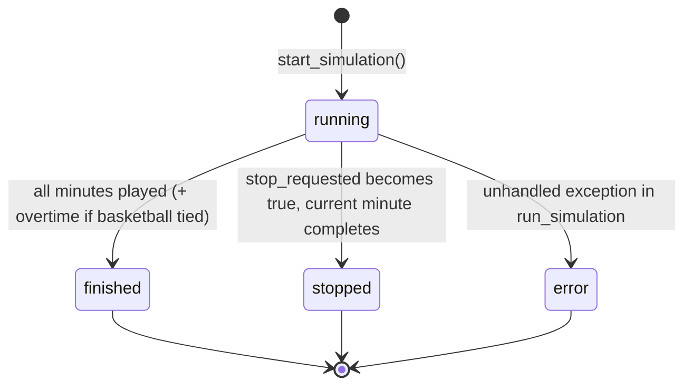
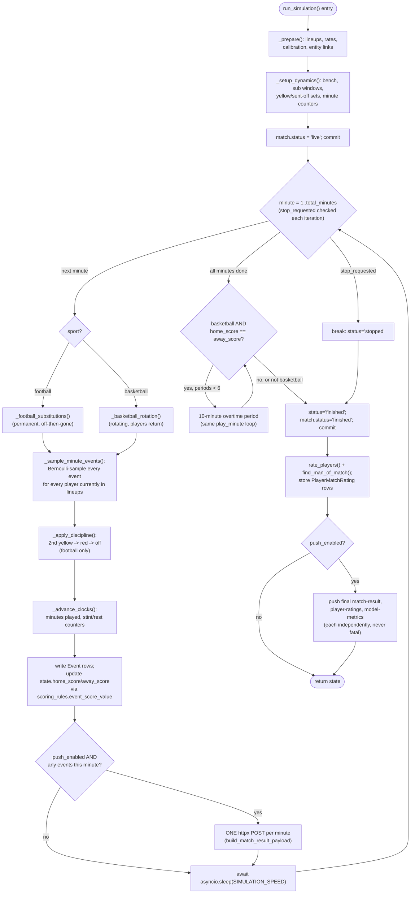

# Simulation Engine — Full Deep Dive

**File:** `app/services/simulation.py` (799 lines — the largest single file in the
codebase). This document traces execution exactly as the code runs it, function by
function, with no invented behavior. Every claim below is anchored to a specific function
in that file unless stated otherwise.

## 1. What triggers a simulation

Two entry points construct a `SimulationState` and schedule it, both ultimately calling
`start_simulation` (lines 782-799):

- `POST /simulate` (`app/routers/simulation.py:start_match_simulation`) — the direct path.
- `POST /demo/launch` (`app/routers/demo.py:demo_launch`) — schedules the fixture and
  registers players on the Sporty backend first, then calls `start_simulation` the same
  way, optionally with a list of `featured_players` names.

`start_simulation` (lines 782-799):
```python
state = SimulationState(match_id=match_id, sport_type=sport_type,
                         total_minutes=TOTAL_MINUTES[sport_type])
_simulations[match_id] = state
state.task = asyncio.get_running_loop().create_task(
    run_simulation(state, event_rates, client, featured)
)
return state
```
`TOTAL_MINUTES = {FOOTBALL: 90, BASKETBALL: 48}`. The `SimulationState` is registered in
the module-level `_simulations: dict[int, SimulationState]` **before** the background
task starts, so a `GET /simulate/{id}/status` call issued immediately after the `202`
response always finds a valid (if `current_minute=0`) state — there is no race window
where the state doesn't exist yet.

Because `_simulations` is an ordinary in-process Python dict, **all simulation state is
lost if the process restarts** — this is a deliberate, low-effort design suitable for a
single-process demo tool (see `IMPROVEMENTS.md`).

## 2. `SimulationState` — the mutable state machine

```python
@dataclass
class SimulationState:
    match_id: int
    sport_type: SportType
    total_minutes: int
    status: str = "running"          # running | finished | stopped | error
    current_minute: int = 0
    home_score: int = 0
    away_score: int = 0
    events_inserted: int = 0
    push_failures: int = 0
    stop_requested: bool = False
    error: str | None = None
    task: asyncio.Task | None = None
```



`stop_requested` is a cooperative flag, not a cancellation — `request_stop(match_id)`
(`app/services/simulation.py:129-134`) just sets `state.stop_requested = True`; the main
loop (§5) checks it once **between** minutes, so `POST /simulate/{id}/stop` halts the
match after the minute currently in progress finishes, not instantly.

## 3. Initialization — `_prepare` (lines 243-354)

Runs synchronously (plain DB queries, no `await`) before the async minute loop starts.

### 3.1 Lineup selection — `_select_lineup` (lines 222-240)

```
LINEUP_SIZE = {FOOTBALL: 11, BASKETBALL: 5}   # on-court, not full roster
BENCH_SIZE  = {FOOTBALL: 9,  BASKETBALL: 5}
```
The football lineup size is deliberately the real on-pitch count (11), and the code
comment explains basketball is 5 (not the full 10-man roster) because "running 10 players
for the full 48 minutes doubled the real on-court minutes and inflated every basketball
stat ~2x" — i.e. this was a fixed bug, not an original design.

Selection algorithm (pseudocode):
```
def select_lineup(roster, size, featured_names):
    if not featured_names:
        return roster[:size]                       # lowest player id first
    wanted = [fold(name) for name in featured_names]
    chosen = []
    for player in roster:                           # pass 1: featured players first
        if any(term in fold(player.name) for term in wanted):
            chosen.append(player)
    for player in roster:                            # pass 2: fill remaining slots by id
        if len(chosen) >= size: break
        if player not already chosen:
            chosen.append(player)
    return chosen[:size]
```
`fold()` (`_fold_name`, lines 213-219) is Unicode NFKD decomposition + diacritic
stripping + a small manual accent map (`ø→o`, `å→a`, `æ→ae`, `ß→ss`, `ł→l`, `đ→d`), so
"featured_players": ["odegaard"]" matches a player literally named "Ødegaard" — a
substring match on the folded string, not exact equality. Rosters are always queried
`ORDER BY Player.id.asc()`, so "lowest id" is a stable, reproducible tie-break, not
insertion order.

Bench = every remaining roster player (not selected as a starter), truncated to
`BENCH_SIZE`.

### 3.2 Rate assignment
For every player in the combined starting lineup, look up `event_rates.get(player.id)`;
on a miss, use the sport-level fallback constants (`_fallback_rates`, §`MODELS.md` §5)
and increment a `cold_starts` counter, logged as a single warning line if any occurred
(not one warning per player — batched for log-noise reasons).

### 3.3 Scoring calibration — `calibrate_scoring_rates` (lines 156-199)

**This is the single most important correctness mechanism in the simulator**, and it is
gated by `SIMULATION_CALIBRATE` (default `True`, forced `False` in tests).

**Problem it solves:** raw per-player rates (whether trained from real
`player_stats` or the league-average fallback constants) do not, when summed across an
11-man lineup over 90 minutes, reliably reproduce a realistic *team* total. Untrained or
sparse-data teams could end up 0-0 forever, or 8-6, purely from Bernoulli noise
accumulated over independent per-player draws.

**Fix:** scale only the *scoring* event rates (`"goal"` for football;
`point_2`/`point_3`/`free_throw` for basketball) so each side's **expected** total score
exactly matches a real league average, computed independently for home and away (which
is what bakes home-advantage into the simulation, since home/away targets differ):

```
FOOTBALL_HOME_GOALS = 1.55   FOOTBALL_AWAY_GOALS = 1.25
BASKETBALL_HOME_POINTS = 104.9   BASKETBALL_AWAY_POINTS = 102.2
```
(Sourced from 13 EPL seasons / 18 NBA seasons per the code comment.)

Algorithm:
```
expected_side_score = total_minutes * sum(scoring_rate(p) for p in side_lineup)
factor = target_average / expected_side_score      # 1.0 if expected is 0 (no scorers)
for each player on that side:
    for each scoring event type:
        rate[event_type] *= factor
```
For basketball, `scoring_rate(p) = 2*rate[point_2] + 3*rate[point_3] + 1*rate[free_throw]`
(the points-per-minute a player is expected to contribute); the factor is solved so that
summed expected points hits the league target. **The factor is uniform within one side**,
so a player who was twice as likely to score as a teammate *stays* twice as likely — only
the overall level is rescaled, not the relative shape.

Non-scoring events (cards, assists, rebounds) are **left untouched** — assists are
handled separately (§4.2) and are coupled to scoring events anyway, so scaling them
independently would double-count the calibration.

Bench players inherit their team's calibration factor (applied to their own raw rates)
so a substitute who comes on scores at the same calibrated level as the starter they
replaced, rather than reverting to an uncalibrated rate.

### 3.4 Featured-player rate floor (applied LAST, after calibration)
```python
FEATURED_RATE_FLOOR = {
    FOOTBALL:   {"goal": 0.03},
    BASKETBALL: {"point_2": 0.06, "point_3": 0.03},
}
```
For any player matched by `featured_players` (demo affordance — guarantee a specific
drafted player gets a stat line), their scoring-event rate is raised to `max(current,
floor)`. Applied *after* calibration specifically so it is never scaled back down to the
league average — the code comment computes the intuition: `floor × total_minutes ≈ 2.7`
expected goals over a football match for that one player, making a goalless outing
"vanishingly unlikely" by design.

### 3.5 Entity-UUID mapping (`_load_entity_uuid_map`, lines 202-210)
Batch-loads every `EntityLink` row needed (match, both teams, every player in the
lineup+bench pool) in up to 3 queries. If the match itself has no `sporty_match_id` link,
a warning is logged and — critically — **the simulation still proceeds**; only the HTTP
push step is skipped (`push_enabled = mappings["match"] is not None`, checked in
`run_simulation`). Events are always written to the feeder's own database regardless.

## 4. The per-minute event model

### 4.1 Bernoulli sampling — `_sample_minute_events` (lines 386-423)

For **every player currently in `setup["lineups"]`** (i.e. currently on the pitch/court —
this list is mutated by substitutions/discipline *before* this function runs each
minute, see §5), and for **every event type in that player's rate dict**:

```python
for player in lineups:
    for event_type, probability in rates_by_player[player.id].items():
        if event_type == "assist":
            continue                          # never sampled standalone
        p = clamp(probability, 0.0, 1.0)
        if p <= 0 or not numpy.random.binomial(1, p):
            continue
        fire(event_type, player)
        if event_type in assistable and numpy.random.binomial(1, assist_prob):
            assister = pick_assister(player, teammates)
            if assister: fire("assist", assister)
```

This is a **per-player, per-event-type, per-minute independent Bernoulli trial** —
`numpy.random.binomial(1, p)` is exactly a coin flip weighted by `p`. There is no shared
"one event per minute" cap: in principle a player could fire multiple different event
types (e.g. `goal` *and* `yellow_card`) in the same minute, each decided independently.
`p` is clamped to `[0,1]` defensively even though calibration/floors should already
produce valid probabilities.

**Why assists are special** (lines 61-74 comment): a real assist can only happen *because*
a teammate scored — it is not an independent event. So `"assist"` is explicitly skipped
in the main per-event-type loop, and instead:

```
ASSIST_PROBABILITY = {FOOTBALL: 0.75, BASKETBALL: 0.58}   # real-data rates
ASSISTABLE_EVENTS  = {FOOTBALL: {"goal"}, BASKETBALL: {"point_2", "point_3"}}
```
Whenever a scoring event in `ASSISTABLE_EVENTS` fires, a **second, separate** Bernoulli
trial at `ASSIST_PROBABILITY[sport]` decides whether that specific goal/basket was
assisted at all (so not every score has an assist — matching that ~75% of EPL goals and
~58% of NBA made field goals are assisted in reality; free throws are correctly excluded
from `ASSISTABLE_EVENTS` since they're never assisted in real basketball).

### 4.2 Assist attribution — `_pick_assister` (lines 357-369)
If the assist coin lands, a **teammate** (never the scorer) is chosen, weighted by that
teammate's own `assist` rate (a genuine weighted random choice, not uniform):
```python
weights = [max(rate[teammate].get("assist", 0), 1e-4) for teammate in candidates]
probs = weights / sum(weights)
assister = candidates[numpy.random.choice(len(candidates), p=probs)]
```
The `1e-4` floor prevents a zero-weight teammate from making the whole `probs` vector
degenerate (a `ZeroDivisionError`/NaN guard) — every teammate always has *some* chance,
proportional to their actual playmaking rate. If a scorer has no teammates on the
pitch/court at all (a degenerate edge case, e.g. after multiple red cards), no assist is
generated for that goal.

### 4.3 Event construction — `_make_event` (lines 372-383)
Every fired event gets `event_id = str(uuid.uuid4())` at generation time (not at DB-write
time) — this is the idempotency key described throughout the codebase. Basketball scoring
events additionally carry `extra = {"points": BASKETBALL_POINT_VALUES[event_type]}` so the
central `scoring_rules.event_score_value` can read the actual point value straight from
the event payload rather than re-deriving it from `event_type` (defensive redundancy — see
`app/services/scoring_rules.py:15-26`, which prefers `extra["points"]` when present and
only falls back to the canonical value table otherwise).

## 5. The minute loop — `run_simulation` → `play_minute` (lines 636-779, `play_minute` at 658-702)



### Exact per-minute order of operations (`play_minute`, lines 658-702)
The code comment states the rationale directly: *"Substitutions happen first so players
entering at minute m play minute m; then events are sampled from the post-sub lineup, and
football discipline (2nd yellow → red → off) is applied last."*

1. **Substitutions/rotation** mutate `setup["lineups"]` in place (`_swap_players`,
   lines 461-463: `list.remove` + `list.append`) — so the player coming on is eligible
   for this minute's event sampling, and the player going off is not.
2. **Event sampling** (§4) runs against the now-current `lineups`.
3. **Discipline** (§6) is applied to `minute_events`, which can *append* synthetic
   `red_card` events (a second yellow) and further shrink `lineups`.
4. **Clocks advance** (`_advance_clocks`, lines 555-566): every player still in
   `lineups` gets `+1` minute in `dynamics["minutes"]`; basketball additionally
   increments each on-court player's `stint` counter and each benched player's `rest`
   counter (used by the rotation logic, §7).
5. **Persistence:** each event in `minute_events` becomes one `Event` ORM row
   (`extra` JSON-serialized via `json.dumps`), `events_by_player` is updated for
   later rating computation, and `state.home_score`/`state.away_score` are incremented
   via `event_score_value` (never re-derived independently — this is the same function
   `matches.py:_score_match` uses, guaranteeing the live-tracked score and the
   replay-computed score can never diverge). One `db.commit()` per minute.
6. **Push:** if the match is linked (`push_enabled`) **and** at least one event fired
   this minute, exactly **one** `httpx` POST is made carrying every event from that
   minute — never one HTTP call per event (an explicit, commented design requirement:
   *"One HTTP call per minute tick — never per-event"*). A push failure only increments
   `state.push_failures`; it never stops or alters the simulation.
7. **Pacing:** `await asyncio.sleep(speed)` where `speed = SIMULATION_SPEED` (config,
   default 0.5 real seconds per simulated minute ⇒ a 90-minute football match takes ~45
   real seconds; `0` = no sleep, used by the test suite for near-instant runs).

## 6. Football discipline — `_apply_discipline` (lines 527-552)

Only runs for `SportType.FOOTBALL`. Walks the events fired this minute:
```
for event in minute_events:
    if player already sent off: skip (no double penalties)
    if event is "yellow_card":
        if player already has a yellow this match:
            mark player sent_off
            append a synthetic "red_card" event (extra={"reason": "second_yellow"})
        else:
            record the first yellow
    elif event is "red_card":
        mark player sent_off (straight red, already fired by the Bernoulli sampler
        as its own low-probability event type in that player's rate dict)
```
After processing, every sent-off player is filtered out of `setup["lineups"]`
**permanently** — football has no way to bring a player back once sent off, and (unlike
substitutions) no bench replacement is added, so the team plays the rest of the match a
player short, exactly matching real football rules. `dynamics["yellows"]`/`sent_off` are
plain Python `set()`s tracked for the whole match.

## 7. Substitutions

Two entirely different models, one per sport — this is a deliberate divergence, not
shared code, because real substitution rules differ fundamentally between the sports.

### 7.1 Football — permanent substitutions (`_football_substitutions`, lines 466-493)

**Pre-planned at kickoff**, not decided live. `_setup_dynamics` (lines 443-458) calls
`_draw_sub_minutes(n, total_minutes)` (lines 426-440) once per team to pre-generate up to
`FOOTBALL_MAX_SUBS = 5` substitution minutes (capped by actual bench size too):
```python
SUB_FIRST_HALF_PROB = 0.08   # injury/tactical-emergency share
SUB_HALF_TIME_PROB  = 0.25   # burst exactly at half-time
# remaining ~0.67 share: uniform random in the 55'-85' window
for _ in range(n):
    roll = random()
    if roll < 0.08:            minute = randint(20, half)
    elif roll < 0.08+0.25:     minute = half + 1          # exactly at half-time
    else:                      minute = randint(half+10, total_minutes-5)
return sorted(minutes)
```
This produces a realistic bimodal-ish distribution: a rare early injury sub, a cluster
right at half-time, and the bulk of subs in the 65'-85' range — matching the code
comment's stated real-world usage pattern.

At each of those pre-drawn minutes, `_football_substitutions` executes exactly one swap:
```
eligible = active outfield players (not the keeper, not a featured/demo player,
           not already sent off) — falls back to "any non-featured active player"
           if no outfielder is eligible, then to "anyone" as a last resort
player_off = random choice from eligible
player_on  = random choice from the bench (removed from bench)
swap them in setup["lineups"]
emit a "substitution" event on player_on, with extra={player_out id+name},
     related_player_id = player_off.id   (so the backend can show who left)
```
The keeper exclusion is a simple string check: `not position.strip().upper().startswith("G")`.
Once substituted off, a player **never returns** (the bench pool only shrinks) — matching
real football's one-way substitution rule.

### 7.2 Basketball — rotating substitutions (`_basketball_rotation`, lines 496-524)

Unlike football, this runs a **checkpoint every `BASKETBALL_ROTATION_INTERVAL = 4`
simulated minutes** (`minute > 1 and (minute - 1) % 4 == 0`), not a pre-planned schedule:
```
for each team:
    swaps = randint(1, min(2, bench_size))   # 1 or 2 players swap this checkpoint
    for each swap:
        player_off = the active player with the LONGEST current stint
                     (dynamics["teams"][tid]["stint"][pid], ties -> higher id excluded
                     via -p.id secondary sort key, so lowest id wins ties deterministically)
        player_on  = the bench player with the MOST accumulated rest
        move player_off to bench, player_on onto the court
        reset player_on's stint counter to 0, player_off's rest counter to 0
        emit a "substitution" event (same shape as football's)
```
The code's own accounting: over 48 minutes at this cadence, this produces roughly 30-40
substitution events per game with starters landing in the "mid-30s" total minutes played
— explicitly tuned to resemble real NBA box scores (starters typically play 32-36
minutes across several 4-8 minute stints). Featured/demo players are excluded from being
rotated off wherever possible (same `featured_ids` exclusion pattern as football).

## 8. Basketball overtime (lines 710-727)

Basketball has no draws in reality, so if `home_score == away_score` after all 48
regulation minutes (and the simulation wasn't manually stopped), the loop plays
additional 10-minute (`OVERTIME_MINUTES`) periods, calling the *same* `play_minute`
function with a continuously incrementing minute counter (so overtime minutes are `49,
50, ... 58` for the first period, etc. — they are not renumbered "OT1 minute 1"). Capped
at `MAX_OVERTIME_PERIODS = 6` "for safety" (the code comment's own words) — an extremely
unlikely but theoretically possible infinite-loop guard, since each period's outcome is
still probabilistic and could keep re-tying.

## 9. Finish sequence (lines 729-764)

1. `state.status = "stopped" if stop_requested else "finished"`; `match.status =
   "finished"` in the DB either way (even a manually stopped match is marked finished,
   not left in `"live"` limbo) — commit.
2. `rate_players(events_by_player, sport_type)` (§`MODELS.md` §7) computes every
   lineup-touched player's rating from their accumulated event list; `find_man_of_match`
   picks the winner.
3. `_store_ratings` (lines 622-633): `DELETE FROM player_match_ratings WHERE match_id=?`
   then bulk-insert fresh rows — a delete-then-insert "upsert," safe because this runs
   exactly once per simulation, inside one transaction.
4. If the match is linked (`push_enabled`): push the final `status="finished"` match
   result (empty event list — this call exists purely to flip the status the backend
   sees), then push the ratings payload (`build_player_ratings_payload`, includes real
   per-player minutes from `dynamics["minutes"]`, not the naive "everyone played the full
   match" assumption), then — best-effort, wrapped in its own bare `try/except Exception`
   — recompute and push the prediction-accuracy scorecard
   (`prediction_metrics.build_metrics_push_payload`), since this newly finished match may
   have settled some previously stored predictions.

## 10. Error handling (outer `try/except`, lines 765-777)

Any unhandled exception anywhere in the above sequence is caught once, at the very
outside: `state.status = "error"`, `state.error = str(exc)`, full traceback logged via
`logger.exception`. The DB session is then rolled back and a **second**, separately
try/excepted, best-effort attempt is made to mark the `Match.status = "error"` too (if
even that fails, it's logged and swallowed — the process must never crash from a
simulation failure). Every event already committed in prior minutes **remains in the
database** — a crash at minute 60 doesn't lose minutes 1-59, only the injected partial
minute's ORM session state.

## 11. Concurrency model

- One `SimulationState` per `match_id` in the shared `_simulations` dict; `is_running()`
  is checked by the router before starting a new one (`409` if already running) and
  before allowing `DELETE /matches/{id}` (unless `force=true`).
- Each simulation's `asyncio.Task` runs on the single-threaded event loop that Uvicorn
  drives — there is **no multiprocessing/multithreading** for simulations; multiple
  concurrent simulations are cooperative, interleaved via `await asyncio.sleep(...)`
  points, never truly parallel CPU work. This is why `SessionFactory()` (a fresh session
  per task, not the thread-scoped `Session` used by normal request handlers) is used —
  the comment in `app/database.py` explains: "concurrent asyncio simulation tasks share
  one thread," so a thread-scoped session would be silently shared and corrupted across
  tasks.

## 12. Randomness control

There is **no explicit seed** set anywhere in `simulation.py` — every `numpy.random.*`
call uses NumPy's global default RNG state, so **two runs of the same match are never
guaranteed identical**. This is intentional for a live-feeling simulation (a rerun should
look different, like a real replayed match would if played twice) but means simulation
runs are **not reproducible for debugging** — a known trade-off, not a bug (contrast with
the ML training scripts, which do fix `random_state=42` for their train/test splits,
because *those* need to be reproducible for comparison).

## 13. Explain Like I'm New

Picture a football match simulated one minute at a time, 90 times in a row. Each minute,
every player on the pitch gets a private, weighted coin-flip for each thing they could do
(score, get a card, etc.) — a player who scores a lot in real life has a coin biased
toward "goal," a bench player's coin is biased toward "nothing happens." Before kickoff,
those coin-biases get nudged up or down so that, on average across the whole 90 minutes,
the two teams' *total* expected goals match real football's home/away averages — otherwise
you could end up with wildly unrealistic 9-8 scorelines just from bad luck stacking up.
Substitutions and cards are handled like a referee and a manager watching the match: cards
build up (two yellows = a red = the team plays a man down for the rest of the game, no
replacement), and each team has a pre-planned handful of substitutions that come on around
realistic times (mostly the second half). Every event that happens gets written down
immediately and mailed off to the Sporty backend once per minute, in one batch — not one
email per event — so the live scoreboard on the website updates smoothly instead of being
spammed.
